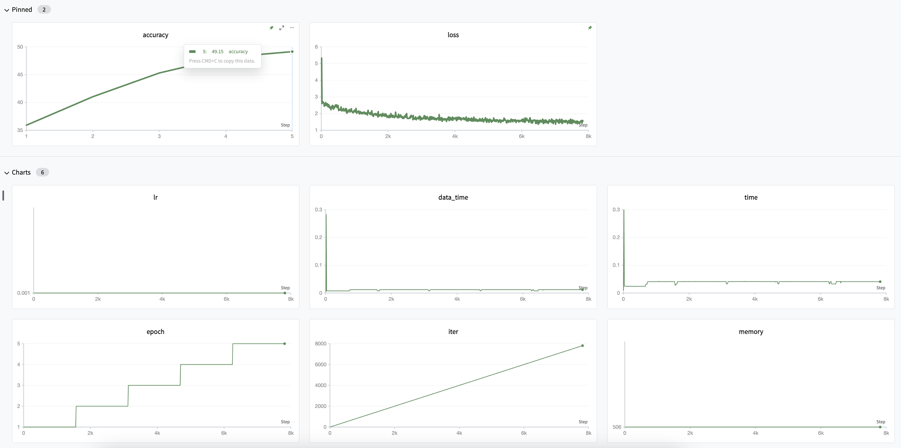

# train resnet50 using mmengine



## descript

this project is a implement for cifar10 classification mission. Use resnet50 as our classifier and use mmengine with our training farmwork.

We use [SwanLab](swanlab.cn) as our training tracker, hope you like it. ; )

## install

Refer to [mmengine official document](https://mmengine.readthedocs.io/en/latest/get_started/installation.html).

Install the environment with following command.

```sh
# with cuda12.1 or you can find torch version you want at pytorch.org
pip install torch torchvision --index-url https://download.pytorch.org/whl/cu121

pip install -U openmim
mim install mmengine
pip install swanlab
```

## train

Just use following command run and it will auto download datasets.

```sh
python train.py
```

## result

As a 5 epoch train (using about 5min in simple RTX3090), we got 49.15% acc. Not bad.

You can find my train log in [SwanLab Project](https://swanlab.cn/@ShaohonChen/cifar10_with_resnet50/runs/f8znz8vj06huv6rm7j5a8/chart)